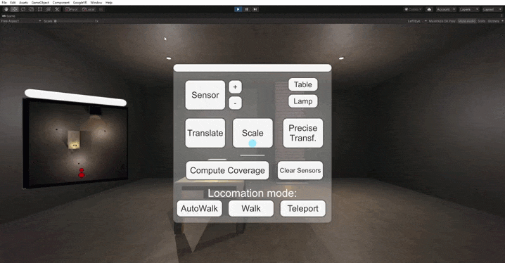

# VR APP : Sensor Coverage Interior
> a 3D VR application using Unity3D for the placement of Sensors in a room and compute their coverag following [UC SanDiego MOOC: Creating Virtual Reality (VR) Apps](https://www.edx.org/course/creating-virtual-reality-vr-apps-2).

## How it works
The user can navigate the room in different locomotion mode, instantiate objects using a panel and a gaze system. Essentially, the user may place sensors in the room and vary their range. Finally, the button "Compute Coverage" allow the user to know the coverage of the sensors taking in account obstacles and other sensors' range.  
A minimap is available for the user to know where he/she is in the environment.

## Demonstrations
 
Furniture instantiation and transformation demonstration:
 

 

 
Locomotion demonstration:
 

 
Sensors coverage demonstration:
 

 

## Requirements
Unity3D is required to use this project.

## Improvements considered
Handle sensors that are totally within another one. For now, these are not removed or reduced to a 0 coverage.

## Contact
For any remarks or issues, contact me at: <contact.keyofmagic@gmail.com>
